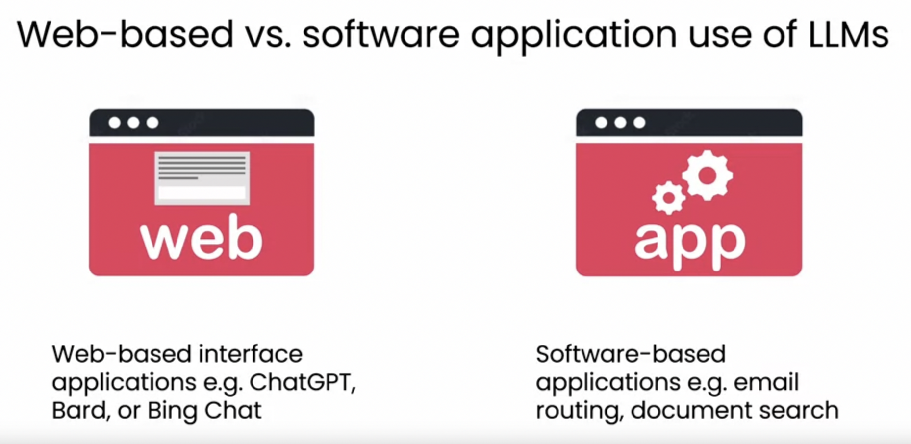

Generative AI For Everyone

Generative AI for Everyone Course

https://www.deeplearning.ai/courses/generative-ai-for-everyone/

Generative AI for Everyone Slides

https://docs.google.com/presentation/d/1u3Qwf8-VHf0tgmcvuC160p7JEvdAkkoAUWdvi4afk6A/edit?slide=id.g2998cc24585_1_46#slide=id.g2998cc24585_1_46

Using generative AI in software applications

https://www.coursera.org/learn/generative-ai-for-everyone

Lifecycle of a generative AI project

https://www.coursera.org/learn/generative-ai-for-everyone

Our Technology stack is OpenAI, Gemini, Pinecone,Langchain, FastAPI, Docker Containers, Docker Compose, Serverless Containers, and Kubernetes

We will develop prototype UI with Streamlit

https://streamlit.io/

We will develop production apps using Next.js

https://vercel.com/templates/next.js/langchain-starter
